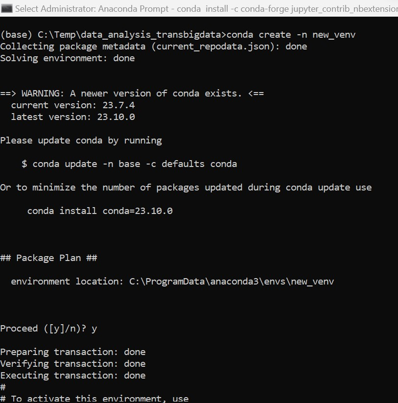
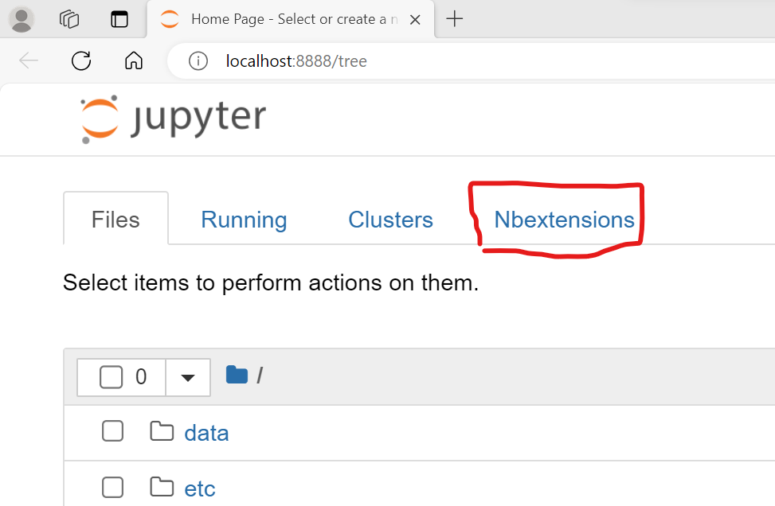
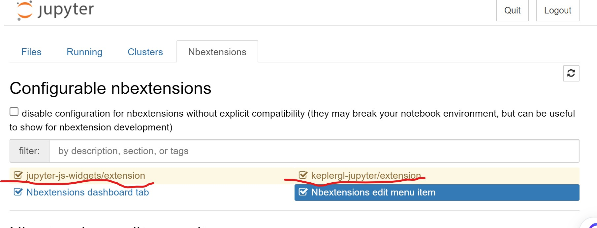

# Test TransBigData with bike data
## Environment
Anaconda: Latest Version

Dependencies: 
`pip install transbigdata keplergl scikit-learn statsmodels`

Reference: https://transbigdata.readthedocs.io/zh_CN/latest/gallery/Example%208-Community%20detection%20for%20bikesharing%20data.html

## Steps
- Run Anaconda Prompt as below screen: . In **Anaconda Prompt**, running below commands:
```
conda create -n transbigdata
conda activate transbigdata

conda install -c conda-forge jupyter_contrib_nbextensions
conda install -c conda-forge jupyter_nbextensions_configurator
pip install transbigdata keplergl scikit-learn statsmodels folium

jupyter notebook
```
- Now, the menu of **Nbextensions** can be seen. 
- Check the settings as below: 
- Enter Solution **bike_data_process_baidu.ipynb** and run it
## Agenda
### 目标①：建立上海某共享单车的使用时间分布模型
完成分析。

### 目标②：建立上海某共享单车的需求模型
完成分析
Exception 对于预测模型不够精确。你们决定是否把相关算法放进去

### 目标③：提供城市交通拥堵情况的参考
完成分析

### 目标④：搭建可能存在的用户关系网
做了用户画像分析，但是没有做用户关系分析。主要是聚合算法不够熟悉

## 关于做PPT
可以考虑jupyter notebook的分析脉络
transbigdata产生的可视化都是可以drill down的。如果把drill down的工作做成视频，效果更好
